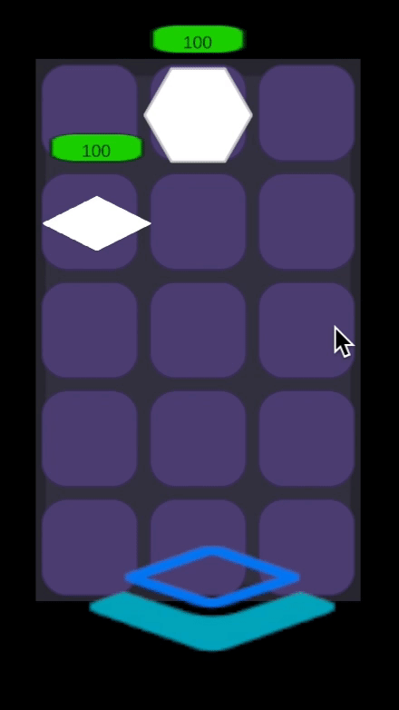
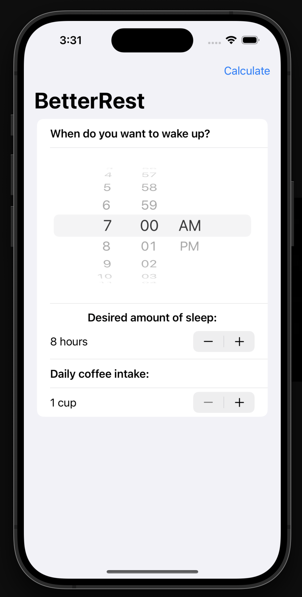
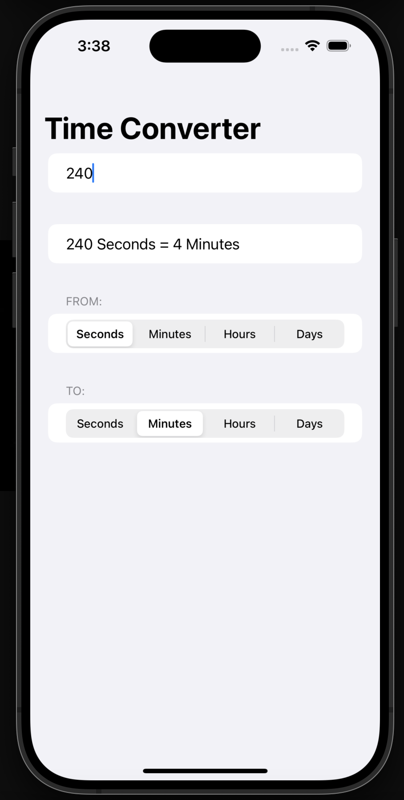
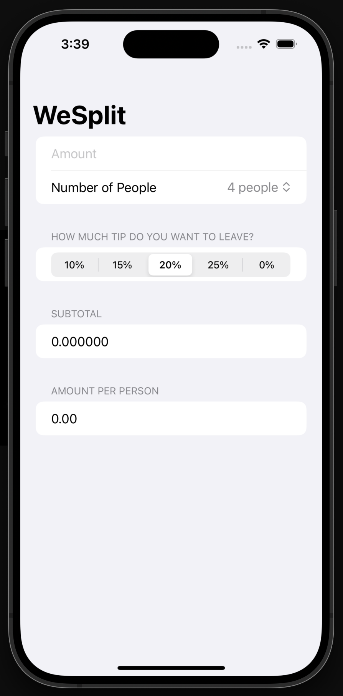
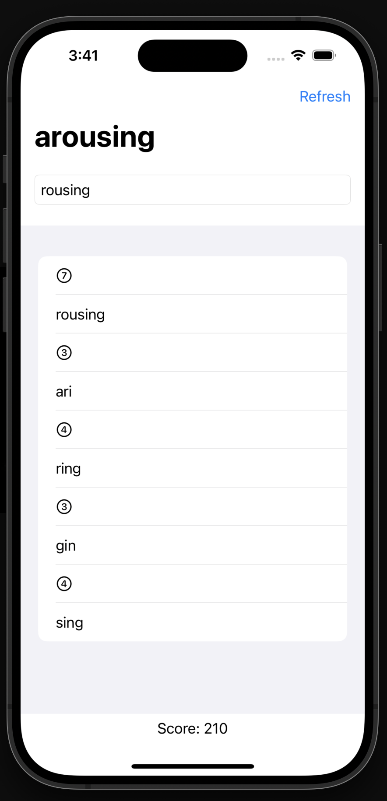
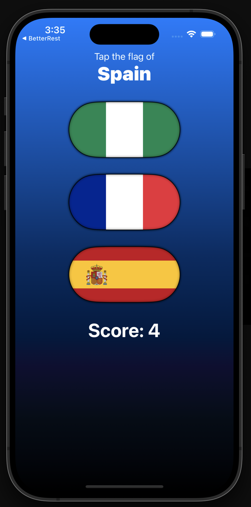
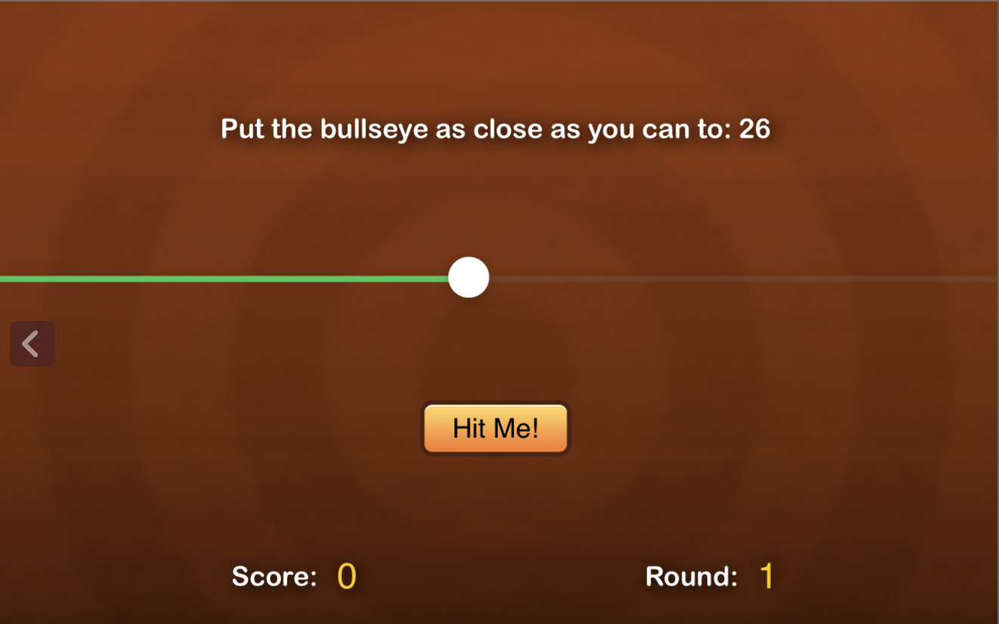

# Personal Projects
Smaller projects I've made outside of mandatory coursework and outside of hackathons, mainly for fun and to practice coding languages! 

# Brief Overview:
### Maplestory App:
A project made to practice **Flutter** & **Dart** based on one of my favorite childhood games.

### Invaded Space:
My contribution to a game coding session in Video Game Development Club using Unity and C# to program player and enemy units and projectile logic. 

### Swift Apps
A series of apps I made using Swift UI, including a sleep tracker, time converter, tip calculator, Word Scrabble, Guess the Flag, and Bullseye game.

